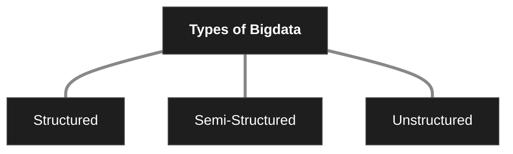

# Characteristics of BigData 
1. Volume: Refers to the massive amount of data generated. Eg: Social Media posts
2. Velocity: Refers to the speed at which data is generated. Eg: Stock Market, GPS
3. Variety: Different types of data:
4. Veracity: It refers to accuracy, reliability. Eg: no duplicate or redundant data 
5. Value: It's related to useful or meaningful information. Eg: Detection of fraud in banking sector 
# Types of BigData 

1. Structured: 
	- Organized in a fixed format usually in tables, rows and columns. 
	- Fast to process and analyze 
	- Eg: Student records, employee database, sales report
2. Semi-Structured: 
	- It does not follow a strict table format but it contains tags 
	- Partially organized, more flexible 
	- Eg: Log files, XML Files 
3. Unstructured: 
	- It has no predefined format or structure 
	- Eg: Images, videos, audios, social media posts, CCTV footage 
# Traditional approach vs BigData Approach 

| Type              | Traditional                                                                          | BigData                                                                                  |
| ----------------- | ------------------------------------------------------------------------------------ | ---------------------------------------------------------------------------------------- |
| Usage             | Enterprise Level                                                                     | Outside enterprise Level                                                                 |
| Size              | Gigabytes to Terabytes                                                               | Petabytes to Zettabytes or Exabytes                                                      |
| Data Type         | Deals mostly with Structured Data                                                    | Deals mostly with structured, Semi-Structured, Database, unstructured data               |
| Speed             | Generated per hour or per day                                                        | Generated mainly per seconds                                                             |
| Data Integration  | Very easy                                                                            | Very difficult                                                                           |
| Data Size         | Very Small                                                                           | More than traditional                                                                    |
| Data Manipulation | Easy to manage and manipulate data                                                   | Huge volume makes it difficult to manage and manipulate data                             |
| Examples          | CRM transaction data, financial data, organizational data, web transaction data, etc | Data sources included social media, device data, sensor data, video, images, audio, etc. |
