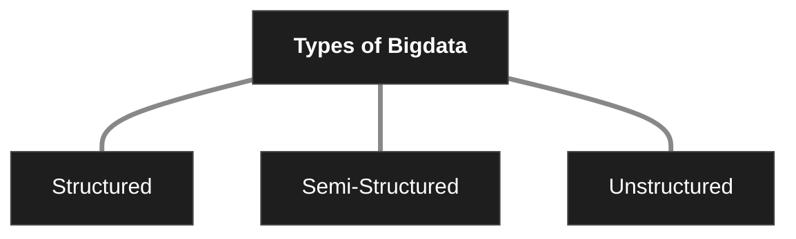
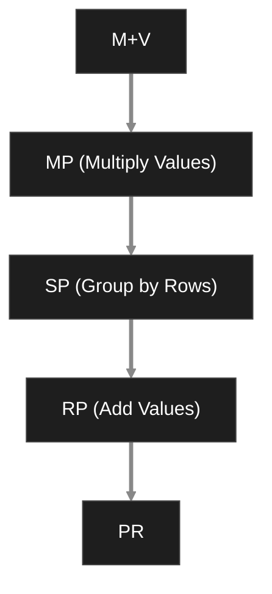

# Characteristics of BigData 
1. Volume: Refers to the massive amount of data generated. Eg: Social Media posts
2. Velocity: Refers to the speed at which data is generated. Eg: Stock Market, GPS
3. Variety: Different types of data:
4. Veracity: It refers to accuracy, reliability. Eg: no duplicate or redundant data 
5. Value: It's related to useful or meaningful information. Eg: Detection of fraud in banking sector 
# Types of BigData 

1. Structured: 
	- Organized in a fixed format usually in tables, rows and columns. 
	- Fast to process and analyze 
	- Eg: Student records, employee database, sales report
2. Semi-Structured: 
	- It does not follow a strict table format but it contains tags 
	- Partially organized, more flexible 
	- Eg: Log files, XML Files 
3. Unstructured: 
	- It has no predefined format or structure 
	- Eg: Images, videos, audios, social media posts, CCTV footage 
# Traditional approach vs BigData Approach 

| Type              | Traditional                                                                          | BigData                                                                                  |
| ----------------- | ------------------------------------------------------------------------------------ | ---------------------------------------------------------------------------------------- |
| Usage             | Enterprise Level                                                                     | Outside enterprise Level                                                                 |
| Size              | Gigabytes to Terabytes                                                               | Petabytes to Zettabytes or Exabytes                                                      |
| Data Type         | Deals mostly with Structured Data                                                    | Deals mostly with structured, Semi-Structured, Database, unstructured data               |
| Speed             | Generated per hour or per day                                                        | Generated mainly per seconds                                                             |
| Data Integration  | Very easy                                                                            | Very difficult                                                                           |
| Data Size         | Very Small                                                                           | More than traditional                                                                    |
| Data Manipulation | Easy to manage and manipulate data                                                   | Huge volume makes it difficult to manage and manipulate data                             |
| Examples          | CRM transaction data, financial data, organizational data, web transaction data, etc | Data sources included social media, device data, sensor data, video, images, audio, etc. |
# BigData Usecases 
1. Healthcare: Contains the details of all the doctors(names, ID, location, department), patients(History, names, diseases, medicines) and all forms of Documents. 
2. Banking & Finance: 
3. Retail and E Commerce 
4. Social Media: All the posts, comments, gifs, everything is part of BigData 
5. Education: All the videos, all the books, texts, papers available online 
6. Entertainment 
7. Transportation: Cab drivers, and passengers, all of them have their own data, and their conversations between each other all contribute to BigData
8. Agriculture 
9. Smart Cities: Waste management, traffic management
10. Research: Research papers written in IEEE, google scholar all contribute towards research work 
11. Cyber Security 
12. NASA: Space research, images, graph, calculations, etc 
# Characteristics of BigData
1. Scalability
2. High Performance
3. Fault Organs 
4. Distributed Processing 
5. Flexibility 
6. Real time processing 
7. Data Security 
8. Reliability
# Map Reduce 
Program by Hadoop for processing large dataset in distributed environment. 
Procedure/Steps: 
1. It divides a task into smaller tasks 
2. Processes them in parallel
3. And then combines the result 
## Step 1 (Divide and Process)
File 1: Apple Mango Apple 
File 2: Mango Banana Apple 
File 3: Apple Banana Banana

|            |             |             |
| ---------- | ----------- | ----------- |
| (Apple, 1) | (Mango, 1)  | (Apple, 1)  |
| (Mango, 1) | (Banana, 1) | (Banana, 1) |
| (Apple, 1) | (Apple, 1)  | (Banana, 1) |
## Step 2 (Grouping)

| Shuffle & Sort |           |
| -------------- | --------- |
| Apple          | (1,1,1,1) |
| Banana         | (1,1,1)   |
| Mango          | (1,1)     |
## Step 3 (Combine results)
Apple = 1+1+1+1=4
Banana = 1+1+1=3
Mango = 1+1=2

When data is too large for one computer, map reduce distributes the work across many computers. 
- Processes huge dataset efficiently 
- Parallel Processing is smoothed out 
- Fault Tolerance 
- Faster processing 
## Matrix Vector Multiplication by Map Reduce 
If a matrix has infinite rows and columns, it will take a long time to solve. Hence, map reduce will divide the work amongst many computers so that they can work at the same time making the computation much faster. 
### Step 1 (Map Phase)
- Each computer takes 1 matrix value and multiplies it with the corresponding vector value 

| Matrix Value | Vector Value | Multiplication |
| ------------ | ------------ | -------------- |
| 2            | 6            | 12             |
| 3            | 7            | 21             |

| Matrix Value | Vector Value | Multiplication |
| ------------ | ------------ | -------------- |
| 4            | 6            | 24             |
| 5            | 7            | 35             |
### Step 2 (Shuffle phase)
- the System groups all values that belong to the same row
	- Row 1: 12, 21;
	- Row 2: 24,35
### Step 3 (Reduce) (Addition)
- The reducer adds the value of each row: 
	- 12+21=33; 
	- 24+35=59;

It is a method of multiplying a matrix with a vector using many computers 
