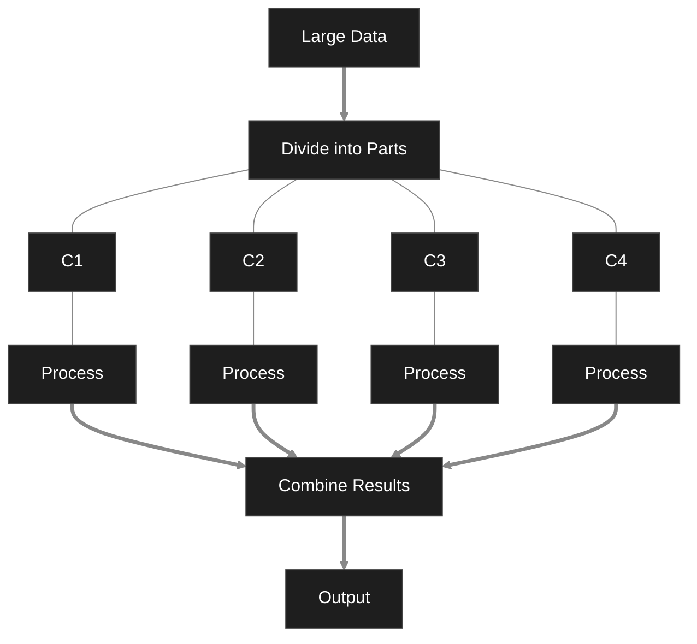

# Architecture Components 

Each computer has it's own CPU, memory and storage. 
## Advantages 
- Processing happens at the same time 
- Handle Large amount of Data
- Can easily add more computers. 
## Disadvantages 
- High Cost 
- High Complexity 
# Unstructured Data Analytics 
- UDA is a process of collecting processing and analyzing unstructured data to extract useful information, patterns and insights. 
- Since unstructured data is complex, technologies such as AI/ML, NLP & BigData are used for analysis. 
- UDA is a process of analyzing data such as text, image, video, audio to obtain meaningful information. 
- UDA is basically used to improve business decisions, detect fraud, predict trends, enhance customer service, understand customer opinion, etc.
## Steps 
1. Data Collecting
2. Data Storage 
3. Data Processing 
4. Data Analysis
5. Data Reporting 
