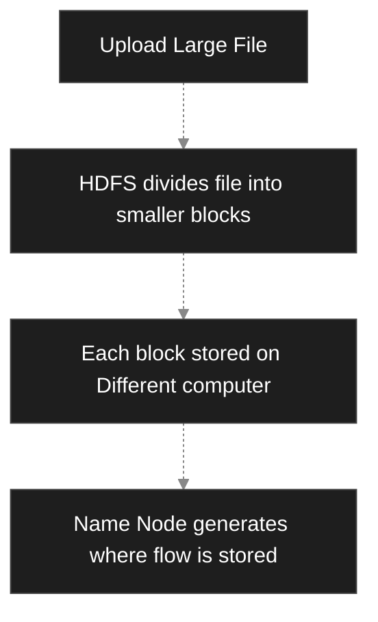

# Hadoop Analytics 
Hadoop is a process of storing and processing and analyzing very large amount of data using the Hadoop framework. 
Hadoop divides large datasets into smaller parts and processes them on multiple computers simultaneously. 
## Need for Hadoop Analysis
- Traditional computers cannot process huge amount of data effectively. 
- Hadoop solves this problem by:
	1. Storing big data across many computers
	2. Processing data in parallel 
	3. Producing results much faster 
## Working 
1. Collect the data: Socials, websites, apps, sensors 
2. Store the data: HDFS
3. Processing the data: Map reduce 
4. Analysis of Data 
# Hadoop Components in Data Analysis
1. HDFS : Hadoop Distributed File System
	- Store Huge amount of data 
2. Map Reduce : Processing of Data in parallel 
	- Apple Orange Mango example 
3. YARN : Yet Another Resource Negotiator 
	- Manages system resources 
	- Schedules the jobs 
4. Hadoop Common : Stores & Provides the libraries, utilities and packages used by Hadoop 
# Limitations of Existing Distributed Systems and Hadoop Approaches 
1. Scalability: Data can go easily from 100 GB to 10 TB making the processing slow on existing hardware 
2. Cost: High Cost
3. Fault Tolerance: Poor fault tolerance 
4. Slow Processing: 
5. Unstructured Data 
6. Storage Problem 
Hadoop approach uses distributed storage and parallel processing to efficiently manage Bigdata. 
## Hadoop solves these problems: 
1. HDFS
2. Parallel Processing: Map Reduce 
3. Fault Tolerance
4. Cost Effective: Hadoop works on ordinary low cost computers instead of expensive servers. 
5. Supports all types of data 
# Hadoop Cluster Components
1. Name Node (MN): Keeps information abotut where date blocks are stored. It does not store actual data, only stores the information of their location. 
2. Data Node (WN): Slave Node / Worker Node 
	- Stores the Actual Data 
	- It sends the data to users when requested
	- Reports its status to the name node
3. Resource Manager (YARN)
	- It allocates system resources 
4. Node Manager
	- Runs on every Slave node 
	- it executes tasks assigned by the resource manager 
## Hadoop Working 
1. Data Input 
2. HDFS Storage 
3. Resource Allocation (YARN activates and schedules jobs)
4. Processing (Map Phase. Parallel work on multiple nodes)
5. Final Output (Reduce Phase. Combines all the results)
### Example for Working:
Imagine a library with 10 Lakh books. 
1. Name Node: it knows where every book is stored 
2. Data Node: Stores the actual book 
3. Resource Manager: assigns librarians to work 
4. Node Manager: Help each librarian to complete the assigned task 
5. Map Reduce: Many libraians will search different shelves
This whole will be similar to hadoop working. 

# DFS : HDFS & GPFS 
## Distributed File Systems : Hadoop Distributed File System & General Parallel File System 
### DFS
- Stores 1 large fule on many computers:
	- 1 Book of 1000 pages, divided into 4 different people of 250 pages each. 
	- To search and ask, all of them can then look for that in the book and it will be faster and easier and will take less amount of time 
	- DFS is a system that stores 1 large file on many computers instead of 1 computer. 
	- To the user it looks like the file is stored in 1 place, but actually different parts of the file are stored on different computers
	- DFS stores data on multiple computers and allows users to access it as one single storage system 
### HDFS 
- Very large files didived into small blocks and stores those blocks on different computers called Data Nodes 
- Stores very large files by dividing them into small blocks and storing those blocks on different computers called Data Nodes 
- HDFS stores BigData into splitting it into small pieces and saving those pieces on many computers 
- Split Files
- Steps:

### GFPS
- Very fast as reading and writing can occur at the same time 
- It is a distributed file system developed by IBM and is designed for very fast reading and writing of files 
- many computers can access the files at the same time 
- GPFS is a high speed distributed file system that allows many computers to read and write the same file simultaneously
- Fast Shared Files

### Difference between HDFS and GFPS

| HDFS                       | GFPS                                     |
| -------------------------- | ---------------------------------------- |
| Used in Hadoop             | Developed by IBM                         |
| Stores BigData             | High speed Shared File system            |
| Best for Data Analysis     | Best fof scientic Computing              |
| Write once read many times | it supports frequent reading and writing |
|                            |                                          |
